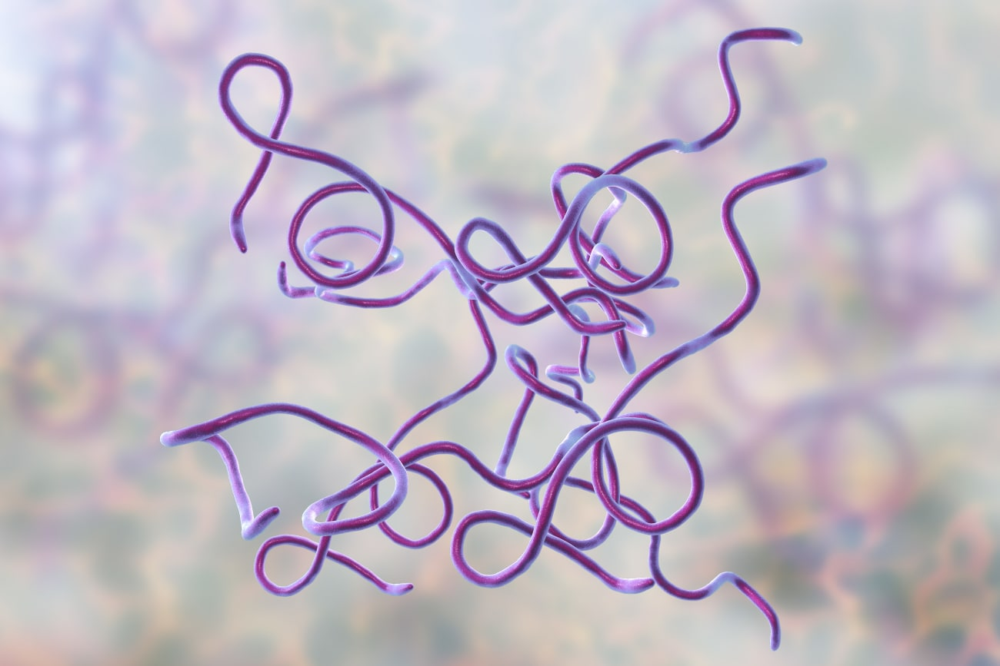

```{r setup, include=FALSE}
knitr::opts_chunk$set(echo = TRUE)
```

# Project Info

This project is created on Feb 10th, 2021. It is linked to my [GitHub repository](https://github.com/janischeng0616/Rentrez). My name is Janis Cheng.

### Import the Sequences.csv file
```{r}
SData <- read.csv("./Sequences.csv") #the file with three 16S gene of Borrelia burgdorferi
```

#### Loading the Dplyr library
```{r}
library(dplyr)
```

### Counting the number of each base pair (A, T, C ,G) in each of the three sequences. 
```{r}
Countfx <- function(char, seq) { #making a function, and it asks for 2 inputs, the character that we want ti count, adn the sequence from which we are counting
  num <- nchar(seq)-nchar(gsub(char,"",seq)) #calculate the occurence of the character by removing it and calculating the difference from the original sequence
  return(num) #gives the count
}

for (i in 1:nrow(SData)) { #to loop through each row 
  SData$A [i] = Countfx("A", SData$Sequence[i]) #make a new column and have the Count function count A, and return the answer in that row
  SData$T [i] = Countfx("T", SData$Sequence[i]) #counting T
  SData$G [i] = Countfx("G", SData$Sequence[i]) #counting G
  SData$C [i] = Countfx("C", SData$Sequence[i]) #counting C
  SData$GC_Content [i] = paste( round((SData$G [i] + SData$C [i])/nchar(SData$Sequence[i])*100, digits = 2), "%") #calculating GC content and display as percentage
  
}
SData #look at the dataframe with the added info
```

### Print out each sequence 
```{r}
list(SData$Sequence) #list out the sequences
```

### The number of each nucleotide as a table for each of the three sequences
```{r}
Table <- transmute(SData, Sequence_ID = gsub("\\s.*","", SData$Name), A_Count = SData$A, T_Count = SData$T, G_Count = SData$G, C_Count = SData$C ) #remaking the dataframe so that it prints the Sequence ID (removing all the words after the first space) and the nucleotide counts
Table #showing the table
```

### An image of the Borrelia burgdorferi bacteria 


### About Borrelia burgdorferi
Learn more on [Wiki:Borrelia burgdorferi](https://en.wikipedia.org/wiki/Borrelia_burgdorferi)

### Final table showing GC content for each sequence ID
```{r}
Final_Table = transmute(SData, Sequence_ID = gsub("\\s.*","", SData$Name), GC_Content=SData$GC_Content) #remaking the dataframe so that it contains the sequence ID and prints the GC%
Final_Table #showing it
```


